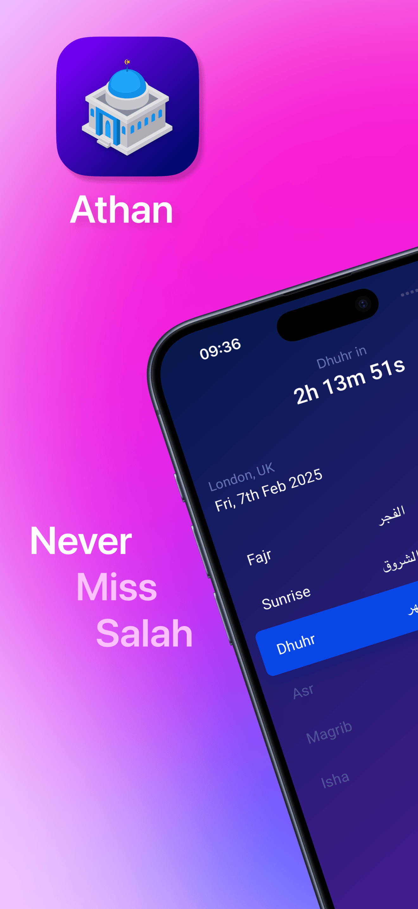
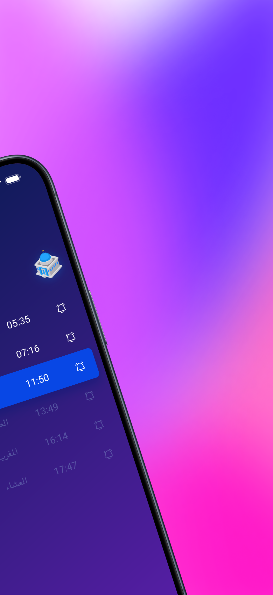
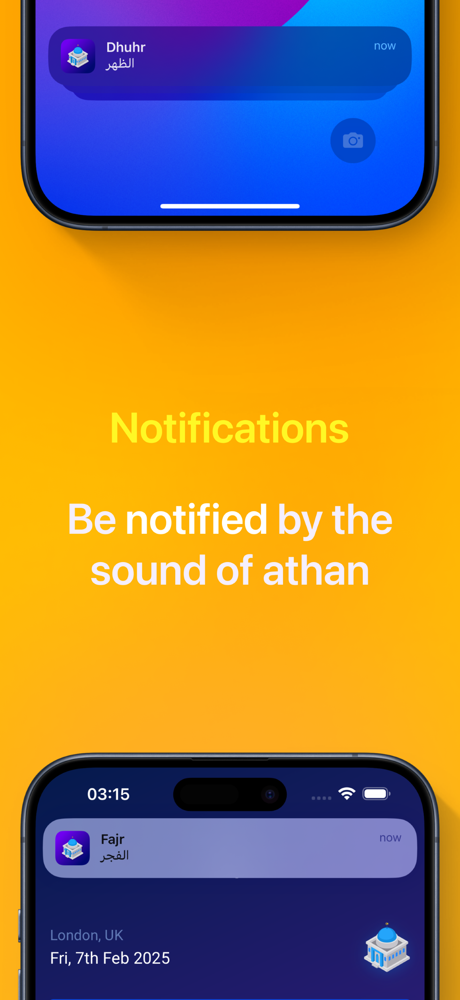
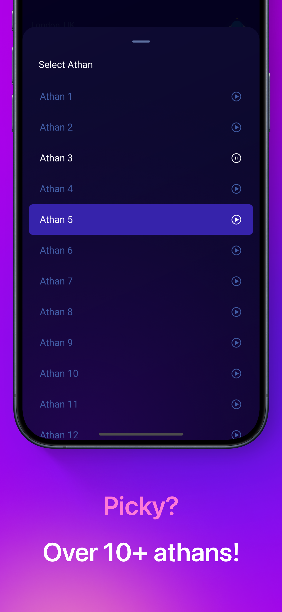
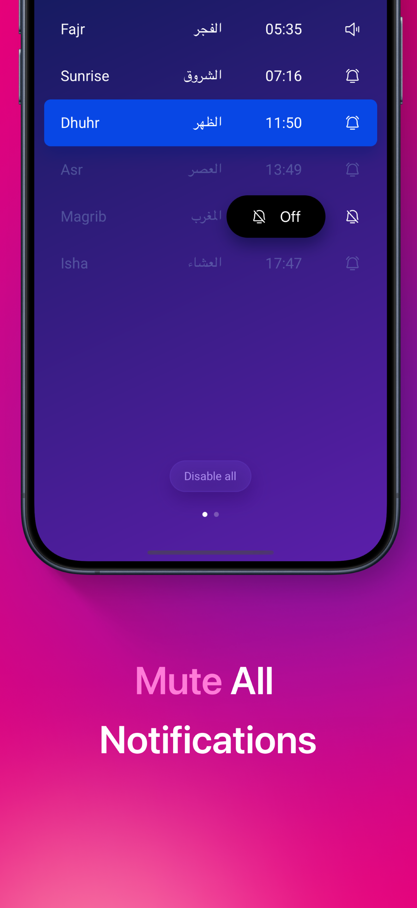
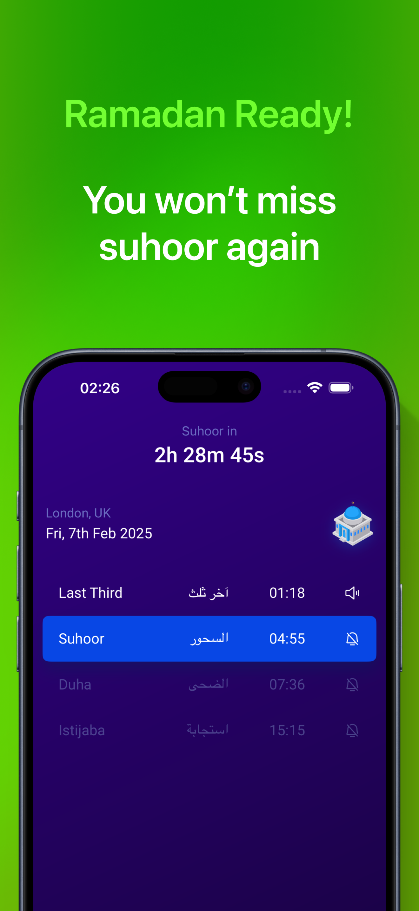
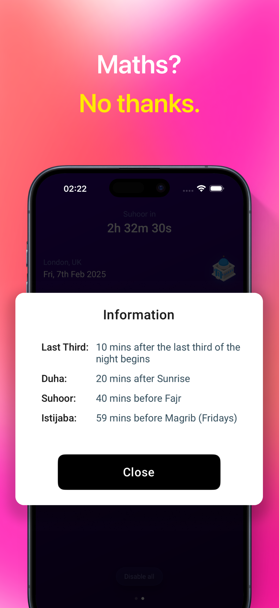
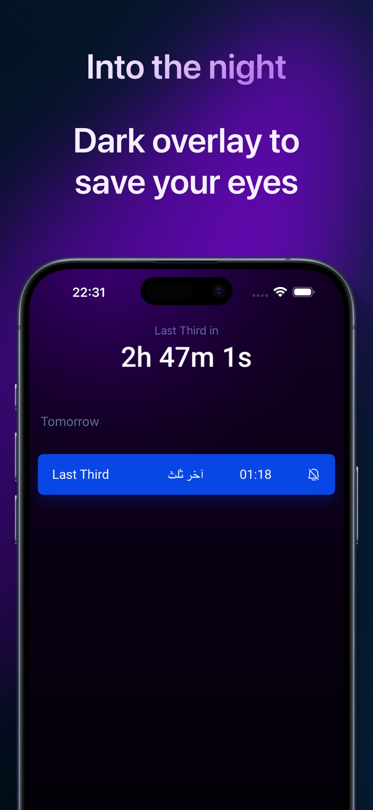
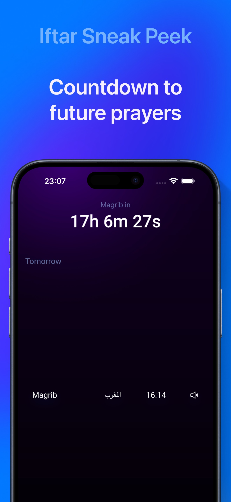
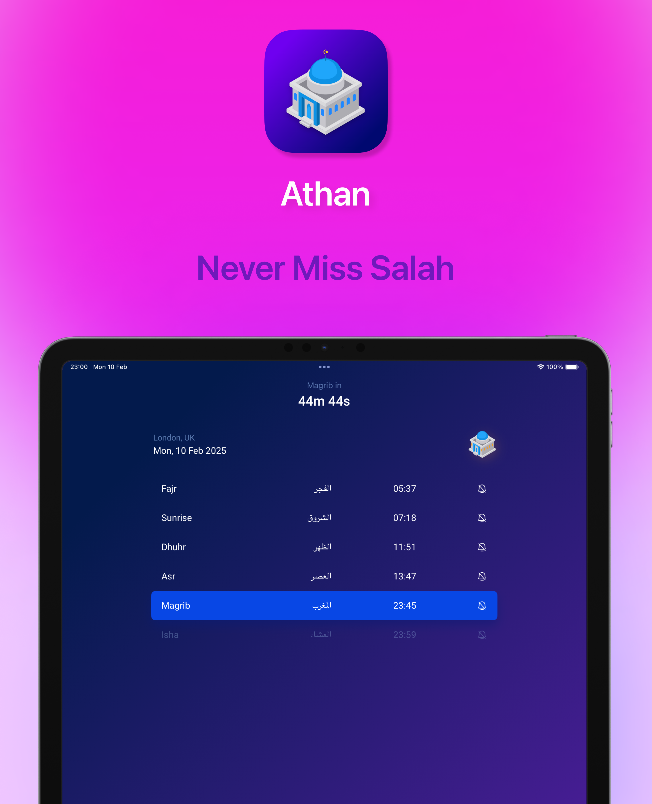

<br/>
<br/>
<br/>

<div align="center">
  
</div>
<br/>

<div align="center">

# Athan.uk

<br/>

[](https://athan.uk)
[](https://athan.uk)
[](https://ios.athan.uk)

A React Native mobile app for Muslim prayer times in London, UK

</div>

<br/>
<br/>
<br/>

## 🎯 Marketing

<br/>

<div align="center">
  
  
  
  
  
  
  
  
  
  
</div>

<br/>
<br/>

### Resources

**[Figma Designs: Marketing](https://www.figma.com/design/FMGlFD7Xz2OUFeGOihFZfO/Untitled?node-id=0-1&t=5PtfJiMrg2OVm1AQ-1)**

**[Figma Designs: App Icon](https://www.figma.com/design/WqP1Vd0aVmyxNuuac4aukJ/Athan-app-icon?node-id=0-1&t=W7KZBNNLhm2vxUgt-1)**

<br/>
<br/>

## 📝 Recent Updates

### v1.29.0 era (2026-09-27 → 2026-10-07)

- ✅ **Qibla compass**: a flat world-map dial that locks north and taps when you line up with Makkah. Android draws only after the phone has been waved in a figure eight (Google's own fused heading sensor); iPhone draws inside the accuracy cone the phone itself reports.
- ✅ **Android home-screen widgets**: eight kinds (Next Prayer / Extra Times × Light / Dark × small / medium), self-refreshing, open the app on tap.
- ✅ **Help modal** answering "why did I not hear the athan?"
- ✅ **Request-budget notifications**: a 64-request budget armed a whole row at a time, next Fajr always armed, replacing the old day-window.

### v1.17.0 (2026-09-01)

- ✅ **Light & Dark home widgets**: each home-screen widget now comes in a Light and a Dark variant whose look is fixed when you place it; they no longer follow the system appearance. The gallery lists eight kinds (Next Prayer / Extra Times × Light / Dark, each in Small and Medium).

### v1.14.0 (2026-08-31)

- ✅ **Extra Times widgets**: a second Home screen pair ("Extra Times", small + medium) and a second Lock Screen pair (rectangular + inline) mirroring the app's Extras page: Midnight, Last Third, Suhoor, Duha, and Friday-only Istijaba. Styling is identical to the prayer widgets; the medium list reads in the app's canonical order (Istijaba last on Fridays; 4 rows normally, 5 on Fridays) and center-anchors vertically so the top/bottom spacing stays symmetric, with a rose active pill instead of indigo. One shared layout serves both schedules, so the pairs can never drift apart.

### v1.10.0 – v1.12.1 (2026-08-30)

- ✅ **Medium home screen widget**: the 2×4 size pairs the small widget's trio (name · countdown · `HH:mm`) with the day's six prayers exactly like the app's Standard page: the blue active background on the next prayer, passed rows solid, upcoming rows muted, rolling to the next day at Isha (no alert icons, no countdown bar)
- ✅ **Eyebrow pill badge**: the prayer name sits in a soft capsule, periwinkle-white lowercase text over a whisper of sky blue (a hint of the active-prayer blue)
- ✅ **Stale card redesign**: when the timeline runs dry, every surface shows the moon-and-stars mark above "Out of date" with an "Open Athan to refresh" call (two lines on the small card, one on medium)

### v1.9.1 (2026-08-30)

- ✅ **Widget visual polish**: the home screen prayer name is now an uppercase letter-spaced eyebrow in a soft periwinkle that fades into the purple card, the `Sat · London` footer sits closer to the absolute time's tone, and the Lock Screen rectangular widget pairs the countdown with the prayer name (`Magrib · 9m`) with the absolute `HH:mm` below. The duplicate-countdown circular face is retired (orphaned placements render blank)

### v1.9.0 (2026-08-30)

- ✅ **Home screen widget redesign**: "Flat royal" app-theme card (prayer name · minute-ceil countdown · `HH:mm` · `Sat · London` footer), minute-ceil labels everywhere (seconds never display; `59s` becomes `1m`), a label-flip scheduler that re-pushes within 250ms of every minute change while the app runs, and realistic launch-relative mock data for repeatable testing

Full history: `git log --oneline` (every commit carries its version number).

<br/>
<br/>

## 🗺 Roadmap

### Shipped

- [x] Prayer times display with real-time countdown; prayer-based day boundary (Islamic midnight); offline after first sync
- [x] Customizable notifications: per-prayer at-time + up to two reminder slots, request-budget buffer (64 requests), deterministic IDs, sequential queue
- [x] Selectable Athan audio (32 sources credited below); reminder audio recorded in-house
- [x] Multipage with special times (Midnight, Last Third, Duha, Suhoor, Friday Istijaba)
- [x] Home screen and Lock Screen widgets on **iOS and Android** (Light/Dark, self-refreshing, minute-ceil labels)
- [x] **Qibla compass** on a flat world map: north-locked dial, haptic on alignment, vouched-heading-only drawing (2026-09-29 → 2026-10-07)
- [x] Help modal answering "why did I not hear the athan?"
- [x] Large overlay font for visually impaired; settings sheets (countdown bar, Hijri date, seconds, time passed, Arabic names, decorations, color picker)
- [x] App updates: Play in-app updates on Android, iTunes Lookup + modal on iOS; What's New popup after every release
- [x] SDK 58 preview (React 19, RN 0.88, Expo 58) riding since 2026-09

### Known limitations

- On some Android phones (ColorOS / OxygenOS), at-time alerts can arrive about a minute late. The fix is built and proven on test devices; it ships with the next store release.

### Upcoming

- [ ] Store release carrying the exact-alarm fix for ColorOS / OxygenOS phones (waits on the SDK 58 stable re-pin)
- [ ] Multi-location support, deferred indefinitely; the research concluded scraping is unnecessary ([ADR-008](ai/adr/008/ADR.md) / [ADR-009](ai/adr/009/ADR.md))
- [ ] Localisation groundwork and global prayer times are researched and awaiting product decisions; moonsighting research is paused

<br/>
<br/>

## 📱 Widgets

Athan ships home screen and Lock Screen widgets on **both platforms**, built with [`expo-widgets`](https://docs.expo.dev/versions/latest/sdk/widgets/) and [`@expo/ui`](https://docs.expo.dev/versions/latest/sdk/ui/swift-ui/) on iOS and Jetpack Glance on Android; no hand-written SwiftUI, and the Android cards self-refresh through their own native module.

| Widget | Where | Sizes | Shows |
| --- | --- | --- | --- |
| **Next Prayer** | Home (iOS + Android) | Small, Medium | **Light and Dark variants. Small**: uppercase bold rose prayer name, minute-ceil countdown (`2h`, `1h 12m`, `9m`, `1m`), the prayer's `HH:mm`, a `Sat · Lon` footer. **Medium**: the same trio on the left; on the right, the day's six prayers like the app's Standard page: the indigo active pill on the next prayer, passed rows solid, upcoming muted. On Android the columns are proportional shares of whatever the launcher grants |
| **Extra Times** | Home (iOS + Android) | Small, Medium | The same faces for the Extras schedule: Midnight, Last Third, Suhoor, Duha, Istijaba (Fridays only; 4 rows normally, 5 on Fridays), centre-anchored, a **rose** active pill instead of indigo |
| **Next Prayer** | Lock Screen (iOS) | Rectangular, Inline | The next prayer with its minute-ceil countdown (`Magrib · 9m`) and absolute `HH:mm`, in the system's vibrant style. **Three layouts per schedule** are registered; the picker offers what your iOS version supports |
| **Extra Times** | Lock Screen (iOS) | Rectangular, Inline | The same faces for the Extras schedule |

- Each home widget's Light or Dark look is fixed when you place it; it never follows the system appearance.
- On Android, tapping a widget opens the app.

**Always in sync, never stale:**

- The app pushes a **3-day timeline per schedule × theme** at every point fresh data is known: app sync, foreground return, the 2-hour foreground notification refresh, the 3-hour background task, and (debounced) any change to a widget-visible setting.
- The countdown label is a **minute-ceil value**: seconds never display and the label always rounds up (`59s` becomes `1m`). Each timeline entry carries its label; the countdown itself is a native text timer that iOS ticks every second in the widget's own process (Android computes the label when it renders). While the app runs, a label-flip scheduler re-pushes within a quarter second of every minute change.
- Entries transition at each time's boundary; the list rolls to the next day exactly when the countdown target does, DST-safe. If the app stays unopened past the timeline, the widgets show the **stale card**: the moon-and-stars mark above "Out of date" with an "Open Athan to refresh" call.
- Widget preferences mirror the app (Hijri date footer today; the widget has no configuration of its own). Changing one in the app re-pushes the timeline within about a second.

> Widgets require a development build or production binary (iOS 16.4+); they are not available in Expo Go.

<br/>
<br/>

## 📡 Data Source

Prayer times data sourced from [London Prayer Times](https://www.londonprayertimes.com/)

<br/>

## 🎵 Athan Audio Sources

Every selectable Athan sound comes from a public recording

1. [Athan 1](https://www.youtube.com/watch?v=_FLhwe8lk14)
2. [Athan 2](https://youtu.be/GwRoKbB-aWo)
3. [Athan 3](https://youtu.be/pY_7ahJV8Qo)
4. [Athan 4](https://www.youtube.com/watch?v=EwCb9d-aYsw)
5. [Athan 5](https://www.youtube.com/watch?v=MaEzj5eRmjc)
6. [Athan 6](https://www.youtube.com/watch?v=iaWZ_3D6vOQ)
7. [Athan 7](https://www.youtube.com/watch?v=qijUyKRiaHw)
8. [Athan 8](https://www.tiktok.com/@sy._454/video/7478742017174965526)
9. [Athan 9](https://vm.tiktok.com/ZN8eTKymA)
10. [Athan 10](https://vm.tiktok.com/ZN8ewBrH3)
11. [Athan 11](https://vm.tiktok.com/ZN8dJroHG)
12. [Athan 12](https://vm.tiktok.com/ZN8RxBFGL)
13. [Athan 13](https://www.youtube.com/watch?v=vS0zBleiJuk)
14. [Athan 14](https://www.youtube.com/watch?v=LxchYJnAY6c)
15. [Athan 15](https://www.youtube.com/watch?v=LSPXGersP-k)
16. [Athan 16](https://www.youtube.com/watch?v=uSU_perLUC4)
17. [Athan 17](https://www.youtube.com/watch?v=IqwB9fS8vdo&list=PLN-zlYr1ZP07sMCdy-qToyZ2HQTwDU0iz&index=6)
18. [Athan 18](https://www.youtube.com/watch?v=G96FEkkFCzg)
19. [Athan 19](https://www.youtube.com/watch?v=aB-1qzmtxaA)
20. [Athan 20](https://vm.tiktok.com/ZN8ewMvhL)
21. [Athan 21](https://vm.tiktok.com/ZN8ewVELB)
22. [Athan 22](https://www.youtube.com/watch?v=4_LN0hznp-A)
23. [Athan 23](https://www.youtube.com/watch?v=9Y-8AtTDx20)
24. [Athan 24](https://www.youtube.com/watch?v=eLGZQpfGEh8)
25. [Athan 25](https://youtu.be/4POoJPsLuz0)
26. [Athan 26](https://www.youtube.com/watch?v=CcAqiX3SNIo)
27. [Athan 27](https://www.dailymotion.com/video/x8gmb7b)
28. [Athan 28](https://www.youtube.com/watch?v=WVLSfmZcsp0)
29. [Athan 29](https://www.youtube.com/watch?v=keTILkYmLJM)
30. [Athan 30](https://www.youtube.com/watch?v=a1U-G2DnC_4)
31. [Athan 31](https://www.youtube.com/watch?v=eRqwFHzJrGc&list=PLN-zlYr1ZP07sMCdy-qToyZ2HQTwDU0iz&index=13)
32. [Athan 32](https://www.youtube.com/watch?v=j-G8vgDpxiI)

<br/>

## 🎙️ Reminder Audio Sources

Every reminder sound is custom recorded audio for reminders, recorded and edited by the maintainer in [Audacity](https://www.audacityteam.org/), not published elsewhere.

<br/>

## 🎛️ Source Projects

The full Audacity projects for all Athan and reminder audio (for anyone who wants to edit, remix, or re-export the sounds) are available on the [releases page](https://github.com/capt-muji/rn.athan.uk/releases).

<br/>

## ⚡ Features

### Display & User Interface

- 📅 **Daily Prayer Times**: View all 6 standard prayers plus 5 special prayers
- ⏰ **Real-time Countdown**: Live countdown showing exact time remaining
- 🔄 **Tomorrow's Prayer Times**: Swipe between today and tomorrow
- 🔍 **Large Overlay Font**: Accessible mode for visually impaired
- 🌙 **Smart Prayer Tracking**: Automatically tracks passed/next/upcoming prayers
- ⚙️ **Settings**: Countdown bar toggle + color picker, Hijri date, show seconds, time passed, Arabic names, seasonal decorations
- 🗓️ **Hijri Date**: Optional Islamic calendar format
- 🕌 **Arabic Prayer Names**: Optional dual-language display

### Notifications & Alerts

- 🔔 **Customizable Alerts**: Off / Silent / Sound per prayer (at-time and reminder)
- ⏰ **Configurable Reminders**: two independent reminder slots per prayer, 5-30 minutes before, adjustable interval; every prayer × interval plays its own custom audio (see [Reminder Audio Sources](#-reminder-audio-sources))
- 📢 **Selectable Athan Sounds**: Every sound linked to its source (see [Athan Audio Sources](#-athan-audio-sources))
- 📅 **Smart Notification Buffer**: a 64-request budget of scheduled notifications armed a whole row at a time, next Fajr always armed, renewed every 2 hours in the foreground and by the 3-hour background task even if the app is never opened
- 🛡️ **Sequential Scheduling Queue**: Operations queued and executed in order, never dropped
- 🪪 **Deterministic Notification IDs**: `athan_<schedule>_<prayer>_<date>` (reminders include the interval); re-scheduling with the same ID replaces in place on both platforms, so orphaned alarms can never double-fire

### Data & Offline Support

- 💾 **Local Data Caching**: Entire year stored in MMKV v4
- 🔄 **Automatic Yearly Refresh**: Detects year transition, fetches new data
- 📱 **Full Offline Support**: Works after initial sync
- ➖ **Unreadable Times**: A time the source sends unreadably, or a day it leaves out, shows as `--:--`, never a guessed time; everything else on that day still shows, and no alert fires for a `--:--` row
- 🎯 **Precise Synchronization**: Countdown countdowns sync with system clock
- ⬆️ **Smart App Upgrades**: Clears stale cache, preserves preferences

## 🔄 App Updates

Each platform asks its own store, once every 24 hours on launch (`device/updates.ts`). Nothing is hand-edited after a
release, and the two platforms are deliberately different, because Apple offers no in-app update mechanism and Google
does.

| | Android | iOS |
| --- | --- | --- |
| **Who decides an update exists** | Google Play, through the in-app updates API (`expo-in-app-updates`) | iTunes Lookup, compared with `shared/versionUtils.ts` |
| **Who asks the user** | Play's own overlay | `components/modals/Update.tsx`, because nothing native exists |
| **Where the user updates** | inside the app, never leaving it | an App Store sheet over the app |
| **Custom code** | none | the modal, and the store link behind its button |

### Android: Play's flexible flow

Play answers whether an update exists, so the app never compares versions. The flow is **flexible**, not immediate: the
user taps once to consent (Google requires that tap and no app can skip it), Play downloads in the background while the
app stays usable, and the update installs itself when the download finishes. A prayer-times app must never be blocked
by an update, which is why immediate is not used. `updatePriority()` in Play Console can escalate later without an app
change.

The app's own update modal never appears on Android: `checkForUpdates()` always resolves `false` there, so Play's
overlay and our modal can never stack.

### iOS: the modal

| Scenario | Result |
| --- | --- |
| **Store version newer than installed** | A dismissible popup with "Later" and "Update". "Update" opens the App Store; "Later" dismisses it. It can reappear after 24 hours |
| **Store version equal or older** | Nothing. No popup |
| **The store published no version, or the fetch fails** | Nothing. The check is silently skipped, and the app never shows an error for a failed update check |

A user with App Store automatic updates enabled is already updated by their next launch, so they never see the modal;
they see the What's New modal instead. A user without it sees the modal, updates, and gets What's New on return.

`country=gb` is load-bearing on the iTunes lookup, not tidiable: the app is published in the GB storefront alone, and a
`bundleId` lookup is storefront-scoped, so every other country answers `resultCount 0`.

### Throttle

A check that reached its store costs the full 24 hours. A check that never reached it (offline, or Play unreachable)
costs one hour instead, so an offline launch does not lose that day's check. Neither fetch can hang: the iOS lookup is
abandoned after 10 seconds.

### Release workflow

1. Fill in the What's New content for this release in `shared/whatsNew.ts` (see below)
2. Push the update to the stores
3. That is all. Users are prompted automatically within 24 hours of the store release

<br/>

## 🆕 What's New Popup

After a user updates the app, a one-time "What's New" modal tells them what they got (`shared/whatsNew.ts` + `components/modals/WhatsNew.tsx`). It exists because ~half the base auto-updates (never seeing store release notes); this is the only channel that reliably reaches them.

| Scenario                                        | Result                                                                                              |
| ----------------------------------------------- | --------------------------------------------------------------------------------------------------- |
| **Update to a release with What's New content** | Modal shows once, on the first launch after the update (works identically for auto and manual updates) |
| **Update skipping several versions**            | Same modal: only the installed version's items, never accumulated history                          |
| **Update to a silent release (content is null)**| No modal; bug-fix-only releases stay quiet                                                         |
| **Fresh install**                               | Never shows: the shown-version tracker is seeded at first boot                                     |
| **Uninstall + reinstall**                        | Never shows: storage is wiped, reinstall counts as a fresh install                                 |
| **Relaunch on the same version**                 | Never shows again: shown once per version, marked on display (crash-safe)                          |

Behavior notes:

- The version in the title is read from the installed binary at runtime (never a hand-typed string; EAS manages store versions remotely)
- Every item declares its platform availability with glyphs in the leading column: Apple for iOS-exclusive, Android for Android-exclusive, both stacked for cross-platform; identical on every device, never a filter
- If the update nag is also eligible (user landed on a non-latest version), What's New shows first; the nag appears after Continue; modals never stack
- In Settings, open About and tap "What's new" to re-open the modal anytime (hidden automatically on silent releases)

### Release Ritual (What's New)

Every store release, edit `WHATS_NEW` in `shared/whatsNew.ts`:

1. Set `version` to the store version being submitted
2. List 1–4 **user-facing items only**: new abilities, removed functionality, behavior changes users will notice. No technical work (SDK migrations, performance, refactors belong in store release notes/README). Factual copy, no marketing
3. Set `WHATS_NEW` to `null` to silent-ship a release (fixes/polish only)

A content contract test (`shared/__tests__/whatsNew.test.ts`) guards the shape: item count, title/body length caps, valid icons and platforms. Dev preview: `EXPO_PUBLIC_WHATS_NEW_PREVIEW=1` in `.env` forces the modal on cold launch (dev builds only). Design rationale: [ADR-012](ai/adr/012/ADR.md).

<br/>

## 🕌 Prayer Times

### Standard Prayers (6)

| Prayer      |
| ----------- |
| **Fajr**    |
| **Sunrise** |
| **Dhuhr**   |
| **Asr**     |
| **Magrib**  |
| **Isha**    |

### Extra Prayers (5)

| Prayer                  | Time                                    |
| ----------------------- | --------------------------------------- |
| **Midnight**            | Midpoint between Magrib and Fajr        |
| **Last Third of Night** | Start of last third of night            |
| **Suhoor**              | 20 minutes before Fajr                  |
| **Duha**                | 20 minutes after Sunrise                |
| **Istijaba**            | 60 minutes before Magrib (Fridays only) |

<br/>

## 🛠 Technical Overview

### Architecture

- **Framework**: React Native 0.88.0-rc, Expo 58 (preview)
- **Language**: TypeScript 7.0 (strict)
- **State**: Jotai atoms (no Redux/Context)
- **Storage**: MMKV v4 (Nitro Module)
- **Animation**: Reanimated 4 (worklets)
- **Notifications**: Expo Notifications
- **Dates**: date-fns / date-fns-tz (London timezone)
- **Native modules** (`modules/`): qibla heading (Google Fused Orientation Provider on Android, Core Location on iOS), TLS 1.3 provider for Android 9 and below, Android widget self-refresh

### Key Design Decisions

1. **Prayer-Centric Timing**: Full DateTime objects, not date+time strings (avoids midnight-crossing bugs)
2. **Prayer-Based Day Boundary**: Schedule advances after final prayer, not midnight
3. **Independent Schedules**: Standard and Extras can show different dates
4. **NO FALLBACKS**: Data layer always provides complete data, UI layer trusts the data

### Data Flow

```
API → Process (strip old dates, calculate special prayers) → Cache MMKV → Display → Schedule notifications
```

### Storage (MMKV)

```
MMKV
├── Prayer Data: prayer_YYYY-MM-DD
├── Fetched Years: fetched_years
├── Notifications: scheduled_notifications_*, scheduled_reminders_*
└── Preferences: preference_* (alert/reminder settings keyed by prayer name,
    e.g. preference_alert_standard_fajr, preference_reminder_interval_extra_istijaba)
```

### Codebase Organization

```
├── app/                    # App entry points and navigation
├── components/             # UI components (prayer/, countdown/, overlay/, sheets/, modals/, ui/, day/)
├── hooks/                  # Custom React hooks (useQibla, useCountdown, useSchedule, ...)
├── stores/                 # Jotai atoms: schedule, notifications, countdown, widget IO, sync, database, ui, version
├── widgets/                # Widget layouts: iOS ('widget'-directive) and the Android Glance layout
├── modules/                # Native Expo modules: qiblaheading, tls13, widgetrefresh
├── shared/                 # Utilities: constants, flags, prayer, time, notifications, qibla* (7 modules), widgetTimeline, whatsNew
├── api/                    # Prayer times API client
├── device/                 # Platform code: notifications, listeners, updates, tasks, qibla, tls13
├── patches/                # patch-package patches (expo-background-task, expo-location, expo-widgets)
├── e2e/                    # Maestro flows, device atlas, frame audit, baseline compare
├── scripts/                # Probes and repo checks
├── mocks/                  # Mock data for development and testing (simple.ts, full.ts)
└── ai/                     # AI agent instructions and ADRs
    ├── AGENTS.md           # Agent behavior instructions
    ├── ISSUES.md           # Issue ledger (decisions, anti-re-litigation)
    ├── prompts/            # The two moonsighting research briefs
    ├── adr/                # Architecture Decision Records
    └── features/           # Long-lived feature records still load-bearing
```

`android/` and `ios/` are generated by `npx expo prebuild` and are git-ignored.

### Key Patterns

1. **Data Flow**: Components, then Hooks, then Stores, then Shared/Api, then MMKV
2. **State Management**: Jotai atoms with derived atoms for computed values
3. **Animations**: Reanimated worklets with custom hooks
4. **Date Handling**: All dates in London timezone using date-fns-tz

### Code Quality

- **Testing**: Jest with babel-jest + @babel/preset-typescript and the React JSX transform for unit tests (`yarn test`); typechecking is a separate `tsc --noEmit` step
- **Type Safety**: Full TypeScript coverage with strict mode
- **Linting**: Biome (lint + format, 120 char lines, 2 spaces, single quotes)
- **Logging**: Pino logger (no console.log statements)
- **JSDoc**: All public functions documented with examples

See [ai/adr/](ai/adr/) for Architecture Decision Records, and [ai/AGENTS.md](ai/AGENTS.md) for the full development protocol.

## 🎨 Tech Stack


<br/>

## 🚀 Development

### Prerequisites

- Node.js 24+ and Yarn
- iOS: Xcode with an iOS simulator (for `yarn ios`)
- Android: Android Studio (for `yarn android`)

### Install and run

```bash
yarn reset      # clears cache, installs packages, sets up husky, starts Metro
yarn ios        # build and run on the iOS simulator
yarn android    # build and run on an Android emulator/device
```

Add a dependency with `npx expo install <package>` (never `npx expo install --fix`; this project intentionally runs newer jest and typescript than Expo pins).

### The commands that gate work

```bash
yarn validate    # tsc + Biome + full Jest suite: the before-done gate
yarn test:tz     # timezone matrix, for anything touching dates
yarn format      # Biome format fixes
yarn check:device <serial>   # audit alarms on a connected Android phone over adb
```

`e2e/` holds the Maestro flows and measurement scripts; `e2e/README.md` documents their gotchas. `ai/AGENTS.md` carries the full development protocol (version bump law, prebuild order, patching rules).

<br/>
